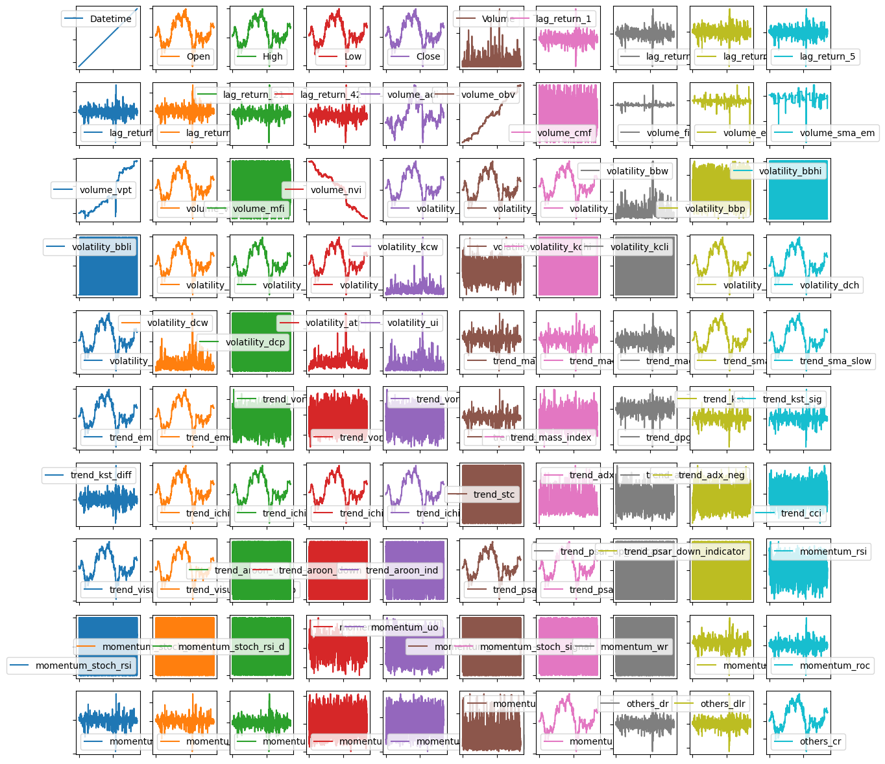
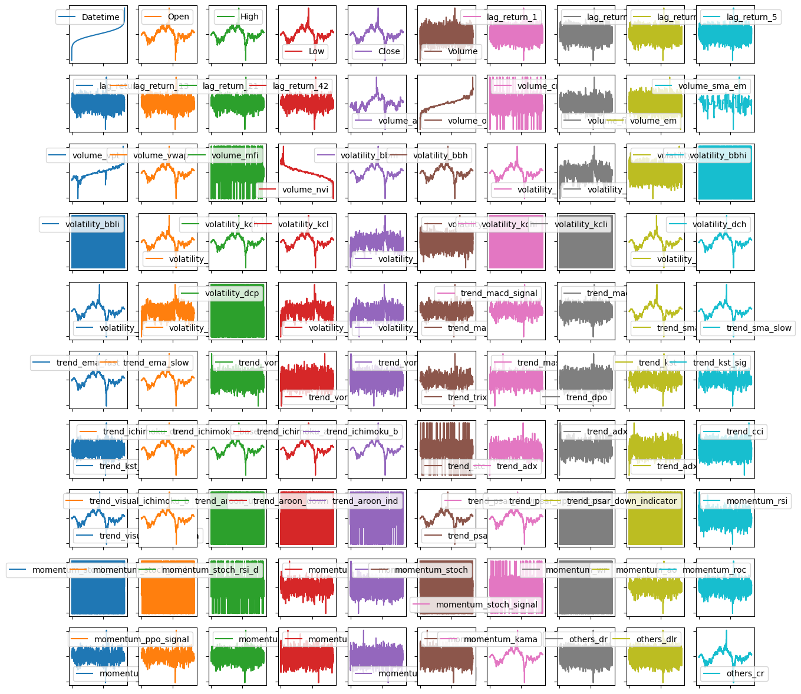
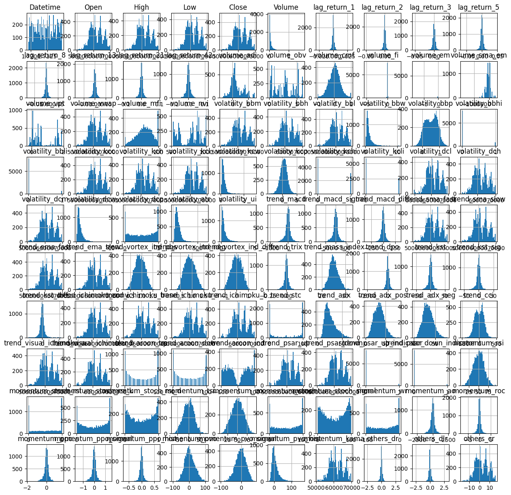
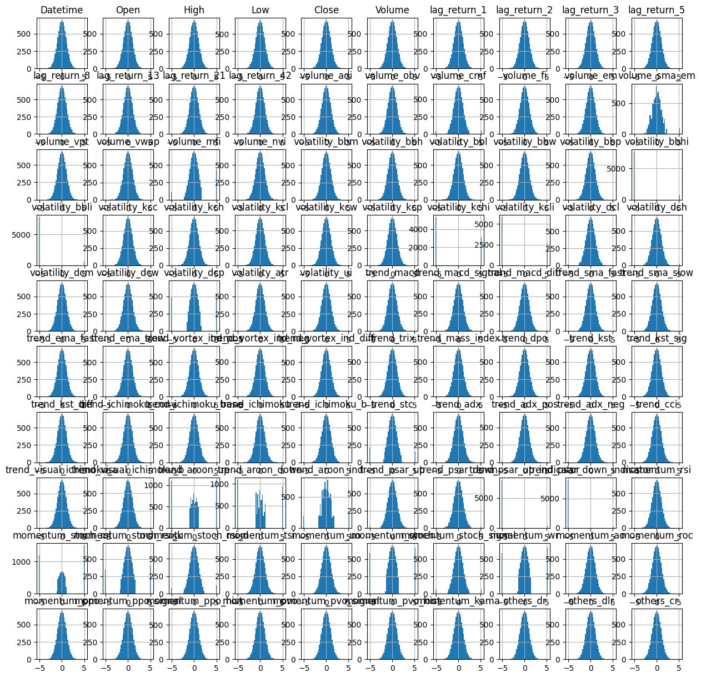
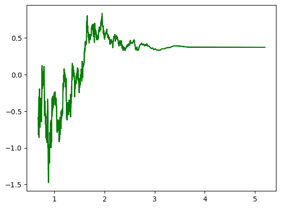
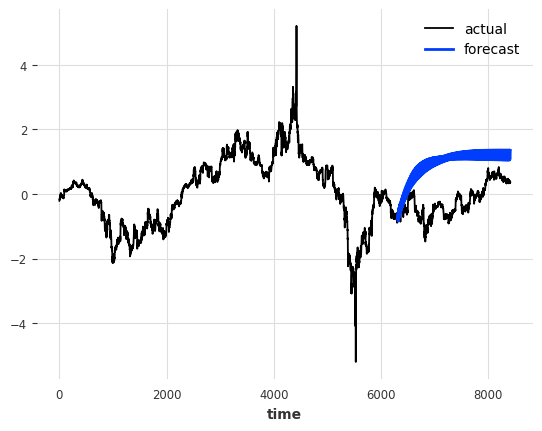

# **Installing Libs**

# **Importing Libs**


```python
import pandas as pd
```


```python
from sklearn.preprocessing import QuantileTransformer
from sklearn.model_selection import train_test_split
```


```python
import matplotlib.pyplot as plt
import matplotlib as mpl
import numpy as np
```


```python
import yfinance as yf
from datetime import datetime, timedelta
```


```python
!pip install ta # install the missing package
```

    Collecting ta
      Downloading ta-0.11.0.tar.gz (25 kB)
      Preparing metadata (setup.py) ... [?25l[?25hdone
    Requirement already satisfied: numpy in /usr/local/lib/python3.10/dist-packages (from ta) (1.26.4)
    Requirement already satisfied: pandas in /usr/local/lib/python3.10/dist-packages (from ta) (2.1.4)
    Requirement already satisfied: python-dateutil>=2.8.2 in /usr/local/lib/python3.10/dist-packages (from pandas->ta) (2.8.2)
    Requirement already satisfied: pytz>=2020.1 in /usr/local/lib/python3.10/dist-packages (from pandas->ta) (2024.1)
    Requirement already satisfied: tzdata>=2022.1 in /usr/local/lib/python3.10/dist-packages (from pandas->ta) (2024.1)
    Requirement already satisfied: six>=1.5 in /usr/local/lib/python3.10/dist-packages (from python-dateutil>=2.8.2->pandas->ta) (1.16.0)
    Building wheels for collected packages: ta
      Building wheel for ta (setup.py) ... [?25l[?25hdone
      Created wheel for ta: filename=ta-0.11.0-py3-none-any.whl size=29412 sha256=94f7a4132504b09509ea4ae0befc3a38bfca45292f73877713327e708f51e0ee
      Stored in directory: /root/.cache/pip/wheels/5f/67/4f/8a9f252836e053e532c6587a3230bc72a4deb16b03a829610b
    Successfully built ta
    Installing collected packages: ta
    Successfully installed ta-0.11.0


```python
from ta import add_all_ta_features
from ta.utils import dropna
```


```python
import os
```

TODO: accept tickers as input


```python
ticker = yf.Ticker("BTC-USD")
start_date = datetime.now() + timedelta(days=-59)
start_date = start_date.strftime("%Y-%m-%d")
end_date = datetime.now().strftime("%Y-%m-%d")

df = ticker.history(start=start_date, end=end_date, interval="5m")
df = df.drop(['Dividends', 'Stock Splits'], axis=1)
```


```python
df = df.reset_index()
df['Datetime']
```


<div>
<style scoped>
    .dataframe tbody tr th:only-of-type {
        vertical-align: middle;
    }

    .dataframe tbody tr th {
        vertical-align: top;
    }

    .dataframe thead th {
        text-align: right;
    }
</style>
<table border="1" class="dataframe">
  <thead>
    <tr style="text-align: right;">
      <th></th>
      <th>Datetime</th>
    </tr>
  </thead>
  <tbody>
    <tr>
      <th>0</th>
      <td>2024-06-29 00:00:00+00:00</td>
    </tr>
    <tr>
      <th>1</th>
      <td>2024-06-29 00:05:00+00:00</td>
    </tr>
    <tr>
      <th>2</th>
      <td>2024-06-29 00:10:00+00:00</td>
    </tr>
    <tr>
      <th>3</th>
      <td>2024-06-29 00:15:00+00:00</td>
    </tr>
    <tr>
      <th>4</th>
      <td>2024-06-29 00:20:00+00:00</td>
    </tr>
    <tr>
      <th>...</th>
      <td>...</td>
    </tr>
    <tr>
      <th>16982</th>
      <td>2024-08-26 23:35:00+00:00</td>
    </tr>
    <tr>
      <th>16983</th>
      <td>2024-08-26 23:40:00+00:00</td>
    </tr>
    <tr>
      <th>16984</th>
      <td>2024-08-26 23:45:00+00:00</td>
    </tr>
    <tr>
      <th>16985</th>
      <td>2024-08-26 23:50:00+00:00</td>
    </tr>
    <tr>
      <th>16986</th>
      <td>2024-08-26 23:55:00+00:00</td>
    </tr>
  </tbody>
</table>
<p>16987 rows × 1 columns</p>
</div><br><label><b>dtype:</b> datetime64[ns, UTC]</label>


```python
def get_ta(df):
    # Add all ta features
    df_ta = add_all_ta_features(df, open="Open", high="High", low="Low", close="Close", volume="Volume")
    df = dropna(df)
    print(df_ta.columns)
    return df_ta.bfill()
# Scale covars
def get_return_lags(df):
    # Create the lagged percentage returns columns
    lag_names = []
    for i in [1,2,3,5,8,13,21,42]:
        col_name = f"lag_return_{i}"
        lag_names.append(col_name)
        df[col_name] = df["Close"].pct_change(periods=i)
    return df
```


```python
def get_quantiletrans(df):
  if 'Datetime' in df.columns:
    # Check if the dtype is datetime64[ns]
    if df['Datetime'].dtype != 'datetime64[ns]':
      # Convert the 'Datetime' column to datetime objects
      df['Datetime'] = pd.to_datetime(df['Datetime'])
    df['Datetime'] = df['Datetime'].apply(lambda x: x.timestamp())
  trans = QuantileTransformer(output_distribution='normal')
  data = trans.fit_transform(df)
  dataset = pd.DataFrame(data, columns = df.columns)
  return dataset
```


```python
# Also adds features to df
ta_df = get_return_lags(df)
ta_df = get_ta(df)
```

    Index(['Datetime', 'Open', 'High', 'Low', 'Close', 'Volume', 'lag_return_1',
           'lag_return_2', 'lag_return_3', 'lag_return_5', 'lag_return_8',
           'lag_return_13', 'lag_return_21', 'lag_return_42', 'volume_adi',
           'volume_obv', 'volume_cmf', 'volume_fi', 'volume_em', 'volume_sma_em',
           'volume_vpt', 'volume_vwap', 'volume_mfi', 'volume_nvi',
           'volatility_bbm', 'volatility_bbh', 'volatility_bbl', 'volatility_bbw',
           'volatility_bbp', 'volatility_bbhi', 'volatility_bbli',
           'volatility_kcc', 'volatility_kch', 'volatility_kcl', 'volatility_kcw',
           'volatility_kcp', 'volatility_kchi', 'volatility_kcli',
           'volatility_dcl', 'volatility_dch', 'volatility_dcm', 'volatility_dcw',
           'volatility_dcp', 'volatility_atr', 'volatility_ui', 'trend_macd',
           'trend_macd_signal', 'trend_macd_diff', 'trend_sma_fast',
           'trend_sma_slow', 'trend_ema_fast', 'trend_ema_slow',
           'trend_vortex_ind_pos', 'trend_vortex_ind_neg', 'trend_vortex_ind_diff',
           'trend_trix', 'trend_mass_index', 'trend_dpo', 'trend_kst',
           'trend_kst_sig', 'trend_kst_diff', 'trend_ichimoku_conv',
           'trend_ichimoku_base', 'trend_ichimoku_a', 'trend_ichimoku_b',
           'trend_stc', 'trend_adx', 'trend_adx_pos', 'trend_adx_neg', 'trend_cci',
           'trend_visual_ichimoku_a', 'trend_visual_ichimoku_b', 'trend_aroon_up',
           'trend_aroon_down', 'trend_aroon_ind', 'trend_psar_up',
           'trend_psar_down', 'trend_psar_up_indicator',
           'trend_psar_down_indicator', 'momentum_rsi', 'momentum_stoch_rsi',
           'momentum_stoch_rsi_k', 'momentum_stoch_rsi_d', 'momentum_tsi',
           'momentum_uo', 'momentum_stoch', 'momentum_stoch_signal', 'momentum_wr',
           'momentum_ao', 'momentum_roc', 'momentum_ppo', 'momentum_ppo_signal',
           'momentum_ppo_hist', 'momentum_pvo', 'momentum_pvo_signal',
           'momentum_pvo_hist', 'momentum_kama', 'others_dr', 'others_dlr',
           'others_cr'],
          dtype='object')


```python
for col in ta_df.columns:
  print(f'{col}: {ta_df[col].dtype}')
```

    Datetime: datetime64[ns, UTC]
    Open: float64
    High: float64
    Low: float64
    Close: float64
    Volume: int64
    lag_return_1: float64
    lag_return_2: float64
    lag_return_3: float64
    lag_return_5: float64
    lag_return_8: float64
    lag_return_13: float64
    lag_return_21: float64
    lag_return_42: float64
    volume_adi: float64
    volume_obv: int64
    volume_cmf: float64
    volume_fi: float64
    volume_em: float64
    volume_sma_em: float64
    volume_vpt: float64
    volume_vwap: float64
    volume_mfi: float64
    volume_nvi: float64
    volatility_bbm: float64
    volatility_bbh: float64
    volatility_bbl: float64
    volatility_bbw: float64
    volatility_bbp: float64
    volatility_bbhi: float64
    volatility_bbli: float64
    volatility_kcc: float64
    volatility_kch: float64
    volatility_kcl: float64
    volatility_kcw: float64
    volatility_kcp: float64
    volatility_kchi: float64
    volatility_kcli: float64
    volatility_dcl: float64
    volatility_dch: float64
    volatility_dcm: float64
    volatility_dcw: float64
    volatility_dcp: float64
    volatility_atr: float64
    volatility_ui: float64
    trend_macd: float64
    trend_macd_signal: float64
    trend_macd_diff: float64
    trend_sma_fast: float64
    trend_sma_slow: float64
    trend_ema_fast: float64
    trend_ema_slow: float64
    trend_vortex_ind_pos: float64
    trend_vortex_ind_neg: float64
    trend_vortex_ind_diff: float64
    trend_trix: float64
    trend_mass_index: float64
    trend_dpo: float64
    trend_kst: float64
    trend_kst_sig: float64
    trend_kst_diff: float64
    trend_ichimoku_conv: float64
    trend_ichimoku_base: float64
    trend_ichimoku_a: float64
    trend_ichimoku_b: float64
    trend_stc: float64
    trend_adx: float64
    trend_adx_pos: float64
    trend_adx_neg: float64
    trend_cci: float64
    trend_visual_ichimoku_a: float64
    trend_visual_ichimoku_b: float64
    trend_aroon_up: float64
    trend_aroon_down: float64
    trend_aroon_ind: float64
    trend_psar_up: float64
    trend_psar_down: float64
    trend_psar_up_indicator: float64
    trend_psar_down_indicator: float64
    momentum_rsi: float64
    momentum_stoch_rsi: float64
    momentum_stoch_rsi_k: float64
    momentum_stoch_rsi_d: float64
    momentum_tsi: float64
    momentum_uo: float64
    momentum_stoch: float64
    momentum_stoch_signal: float64
    momentum_wr: float64
    momentum_ao: float64
    momentum_roc: float64
    momentum_ppo: float64
    momentum_ppo_signal: float64
    momentum_ppo_hist: float64
    momentum_pvo: float64
    momentum_pvo_signal: float64
    momentum_pvo_hist: float64
    momentum_kama: float64
    others_dr: float64
    others_dlr: float64
    others_cr: float64


```python
ta_df = ta_df[np.isfinite(ta_df)]
ta_df = ta_df.dropna()
```


```python
quant_df = get_quantiletrans(ta_df)
```


```python
with mpl.rc_context({'xtick.labelbottom':False, 'ytick.labelleft':False}):
  ta_df.plot(figsize=(15,15), subplots = True, layout=(10,10), xlabel='')

```


    

    


```python
with mpl.rc_context({'xtick.labelbottom':False, 'ytick.labelleft':False}):
  quant_df.plot(figsize=(15,15),  subplots = True, layout=(10,10), xlabel='')
```


    

    


```python
ta_df.hist(figsize=(15,15), bins=50);
```


    

    


```python
quant_df.hist(figsize=(15,15), bins=50);
```


    

    


```python
#scaled_df = get_scaled(ta_df)
#ts_quant_df = TimeSeries.from_dataframe(quant_df, fill_missing_dates=True)
```


```python
target_var = 'Close'
target_var_idx = quant_df.columns.get_loc(target_var)
X = quant_df
y = quant_df[target_var]
```


```python
X_train, X_test, y_train, y_test = train_test_split(X, y, shuffle=False)
```


```python
from sklearn.ensemble import RandomForestRegressor
feature_names = list[X.columns]
forest = RandomForestRegressor(n_estimators=500, random_state=1)
forest.fit(X_train, y_train)
importances = forest.feature_importances_
```


```python
X_test.columns
```


    Index(['Datetime', 'Open', 'High', 'Low', 'Close', 'Volume', 'lag_return_1',
           'lag_return_2', 'lag_return_3', 'lag_return_5', 'lag_return_8',
           'lag_return_13', 'lag_return_21', 'lag_return_42', 'volume_adi',
           'volume_obv', 'volume_cmf', 'volume_fi', 'volume_em', 'volume_sma_em',
           'volume_vpt', 'volume_vwap', 'volume_mfi', 'volume_nvi',
           'volatility_bbm', 'volatility_bbh', 'volatility_bbl', 'volatility_bbw',
           'volatility_bbp', 'volatility_bbhi', 'volatility_bbli',
           'volatility_kcc', 'volatility_kch', 'volatility_kcl', 'volatility_kcw',
           'volatility_kcp', 'volatility_kchi', 'volatility_kcli',
           'volatility_dcl', 'volatility_dch', 'volatility_dcm', 'volatility_dcw',
           'volatility_dcp', 'volatility_atr', 'volatility_ui', 'trend_macd',
           'trend_macd_signal', 'trend_macd_diff', 'trend_sma_fast',
           'trend_sma_slow', 'trend_ema_fast', 'trend_ema_slow',
           'trend_vortex_ind_pos', 'trend_vortex_ind_neg', 'trend_vortex_ind_diff',
           'trend_trix', 'trend_mass_index', 'trend_dpo', 'trend_kst',
           'trend_kst_sig', 'trend_kst_diff', 'trend_ichimoku_conv',
           'trend_ichimoku_base', 'trend_ichimoku_a', 'trend_ichimoku_b',
           'trend_stc', 'trend_adx', 'trend_adx_pos', 'trend_adx_neg', 'trend_cci',
           'trend_visual_ichimoku_a', 'trend_visual_ichimoku_b', 'trend_aroon_up',
           'trend_aroon_down', 'trend_aroon_ind', 'trend_psar_up',
           'trend_psar_down', 'trend_psar_up_indicator',
           'trend_psar_down_indicator', 'momentum_rsi', 'momentum_stoch_rsi',
           'momentum_stoch_rsi_k', 'momentum_stoch_rsi_d', 'momentum_tsi',
           'momentum_uo', 'momentum_stoch', 'momentum_stoch_signal', 'momentum_wr',
           'momentum_ao', 'momentum_roc', 'momentum_ppo', 'momentum_ppo_signal',
           'momentum_ppo_hist', 'momentum_pvo', 'momentum_pvo_signal',
           'momentum_pvo_hist', 'momentum_kama', 'others_dr', 'others_dlr',
           'others_cr'],
          dtype='object')


```python
indices = np.argsort(importances)[::-1]
for f in range(X_train.shape[1]):
    print(f"{f + 1:2}) {X.columns[indices[f]]:<28} {round(importances[indices[f]], 4):>}")
```

     1) Close                        0.5155
     2) others_cr                    0.4814
     3) Low                          0.0015
     4) High                         0.0006
     5) Volume                       0.0002
     6) volume_vpt                   0.0002
     7) volume_obv                   0.0001
     8) momentum_pvo                 0.0001
     9) trend_ichimoku_a             0.0
    10) trend_ichimoku_conv          0.0
    11) volatility_kch               0.0
    12) trend_sma_fast               0.0
    13) Open                         0.0
    14) momentum_kama                0.0
    15) trend_psar_down              0.0
    16) trend_ema_fast               0.0
    17) trend_ema_slow               0.0
    18) trend_dpo                    0.0
    19) momentum_pvo_hist            0.0
    20) volume_vwap                  0.0
    21) momentum_ppo_hist            0.0
    22) momentum_roc                 0.0
    23) volume_sma_em                0.0
    24) trend_ichimoku_base          0.0
    25) momentum_uo                  0.0
    26) trend_sma_slow               0.0
    27) Datetime                     0.0
    28) volatility_kcc               0.0
    29) lag_return_42                0.0
    30) volatility_dcw               0.0
    31) volume_cmf                   0.0
    32) trend_macd_diff              0.0
    33) lag_return_8                 0.0
    34) volume_nvi                   0.0
    35) volatility_bbh               0.0
    36) momentum_stoch_rsi_d         0.0
    37) trend_mass_index             0.0
    38) volume_em                    0.0
    39) trend_vortex_ind_pos         0.0
    40) trend_vortex_ind_neg         0.0
    41) trend_adx_neg                0.0
    42) volume_mfi                   0.0
    43) lag_return_13                0.0
    44) trend_adx_pos                0.0
    45) trend_trix                   0.0
    46) volatility_kcl               0.0
    47) trend_aroon_up               0.0
    48) trend_kst_sig                0.0
    49) volume_adi                   0.0
    50) momentum_stoch_signal        0.0
    51) momentum_ao                  0.0
    52) momentum_ppo                 0.0
    53) volatility_bbl               0.0
    54) trend_aroon_down             0.0
    55) volatility_dcp               0.0
    56) volatility_kcw               0.0
    57) lag_return_21                0.0
    58) volatility_bbp               0.0
    59) volume_fi                    0.0
    60) momentum_tsi                 0.0
    61) lag_return_3                 0.0
    62) lag_return_5                 0.0
    63) others_dr                    0.0
    64) momentum_wr                  0.0
    65) trend_cci                    0.0
    66) momentum_stoch_rsi_k         0.0
    67) momentum_ppo_signal          0.0
    68) volatility_atr               0.0
    69) volatility_bbm               0.0
    70) others_dlr                   0.0
    71) trend_kst                    0.0
    72) momentum_pvo_signal          0.0
    73) volatility_bbw               0.0
    74) trend_kst_diff               0.0
    75) trend_ichimoku_b             0.0
    76) momentum_rsi                 0.0
    77) volatility_ui                0.0
    78) lag_return_2                 0.0
    79) trend_aroon_ind              0.0
    80) trend_adx                    0.0
    81) trend_stc                    0.0
    82) trend_vortex_ind_diff        0.0
    83) trend_visual_ichimoku_a      0.0
    84) volatility_dcm               0.0
    85) volatility_kcp               0.0
    86) lag_return_1                 0.0
    87) trend_psar_up                0.0
    88) volatility_dch               0.0
    89) trend_visual_ichimoku_b      0.0
    90) momentum_stoch               0.0
    91) momentum_stoch_rsi           0.0
    92) trend_macd_signal            0.0
    93) trend_macd                   0.0
    94) volatility_bbli              0.0
    95) volatility_dcl               0.0
    96) volatility_kcli              0.0
    97) trend_psar_up_indicator      0.0
    98) volatility_kchi              0.0
    99) volatility_bbhi              0.0
    100) trend_psar_down_indicator    0.0


```python
plt.plot(quant_df['Datetime'][len(quant_df)-len(y_test):], y_test,  # Slice quant_df['Datetime'] to match the length of y_test
                        color= 'black',
                        label= 'Actual')
plt.plot(quant_df['Datetime'][len(quant_df)-len(y_test):], forest.predict(X_test),  # Slice quant_df['Datetime'] to match the length of y_test
                        color= 'green',
                        label= 'Predicted Data')

```


    [<matplotlib.lines.Line2D at 0x7ed97a92b910>]


    

    


```python
!pip install darts
```

    Collecting darts
      Downloading darts-0.30.0-py3-none-any.whl.metadata (52 kB)
         ━━━━━━━━━━━━━━━━━━━━━━━━━━━━━━━━━━━━━━━━ 52.2/52.2 kB 1.9 MB/s eta 0:00:00
    [?25hRequirement already satisfied: holidays>=0.11.1 in /usr/local/lib/python3.10/dist-packages (from darts) (0.55)
    Requirement already satisfied: joblib>=0.16.0 in /usr/local/lib/python3.10/dist-packages (from darts) (1.4.2)
    Requirement already satisfied: matplotlib>=3.3.0 in /usr/local/lib/python3.10/dist-packages (from darts) (3.7.1)
    Collecting nfoursid>=1.0.0 (from darts)
      Downloading nfoursid-1.0.1-py3-none-any.whl.metadata (1.9 kB)
    Requirement already satisfied: numpy<2.0.0,>=1.19.0 in /usr/local/lib/python3.10/dist-packages (from darts) (1.26.4)
    Collecting pmdarima>=1.8.0 (from darts)
      Downloading pmdarima-2.0.4-cp310-cp310-manylinux_2_17_x86_64.manylinux2014_x86_64.manylinux_2_28_x86_64.whl.metadata (7.8 kB)
    Collecting pyod>=0.9.5 (from darts)
      Downloading pyod-2.0.1.tar.gz (163 kB)
         ━━━━━━━━━━━━━━━━━━━━━━━━━━━━━━━━━━━━━━━━ 163.8/163.8 kB 5.1 MB/s eta 0:00:00
    [?25h  Preparing metadata (setup.py) ... [?25l[?25hdone
    Requirement already satisfied: requests>=2.22.0 in /usr/local/lib/python3.10/dist-packages (from darts) (2.32.3)
    Requirement already satisfied: scikit-learn>=1.0.1 in /usr/local/lib/python3.10/dist-packages (from darts) (1.3.2)
    Requirement already satisfied: scipy>=1.3.2 in /usr/local/lib/python3.10/dist-packages (from darts) (1.13.1)
    Collecting shap>=0.40.0 (from darts)
      Downloading shap-0.46.0-cp310-cp310-manylinux_2_12_x86_64.manylinux2010_x86_64.manylinux_2_17_x86_64.manylinux2014_x86_64.whl.metadata (24 kB)
    Collecting statsforecast>=1.4 (from darts)
      Downloading statsforecast-1.7.6-py3-none-any.whl.metadata (28 kB)
    Requirement already satisfied: statsmodels>=0.14.0 in /usr/local/lib/python3.10/dist-packages (from darts) (0.14.2)
    Collecting tbats>=1.1.0 (from darts)
      Downloading tbats-1.1.3-py3-none-any.whl.metadata (3.8 kB)
    Requirement already satisfied: tqdm>=4.60.0 in /usr/local/lib/python3.10/dist-packages (from darts) (4.66.5)
    Requirement already satisfied: typing-extensions in /usr/local/lib/python3.10/dist-packages (from darts) (4.12.2)
    Requirement already satisfied: xarray>=0.17.0 in /usr/local/lib/python3.10/dist-packages (from darts) (2024.6.0)
    Requirement already satisfied: xgboost>=1.6.0 in /usr/local/lib/python3.10/dist-packages (from darts) (2.1.1)
    Collecting pytorch-lightning>=1.5.0 (from darts)
      Downloading pytorch_lightning-2.4.0-py3-none-any.whl.metadata (21 kB)
    Collecting tensorboardX>=2.1 (from darts)
      Downloading tensorboardX-2.6.2.2-py2.py3-none-any.whl.metadata (5.8 kB)
    Requirement already satisfied: torch>=1.8.0 in /usr/local/lib/python3.10/dist-packages (from darts) (2.4.0+cu121)
    Requirement already satisfied: pandas>=1.0.5 in /usr/local/lib/python3.10/dist-packages (from darts) (2.1.4)
    Requirement already satisfied: python-dateutil in /usr/local/lib/python3.10/dist-packages (from holidays>=0.11.1->darts) (2.8.2)
    Requirement already satisfied: contourpy>=1.0.1 in /usr/local/lib/python3.10/dist-packages (from matplotlib>=3.3.0->darts) (1.2.1)
    Requirement already satisfied: cycler>=0.10 in /usr/local/lib/python3.10/dist-packages (from matplotlib>=3.3.0->darts) (0.12.1)
    Requirement already satisfied: fonttools>=4.22.0 in /usr/local/lib/python3.10/dist-packages (from matplotlib>=3.3.0->darts) (4.53.1)
    Requirement already satisfied: kiwisolver>=1.0.1 in /usr/local/lib/python3.10/dist-packages (from matplotlib>=3.3.0->darts) (1.4.5)
    Requirement already satisfied: packaging>=20.0 in /usr/local/lib/python3.10/dist-packages (from matplotlib>=3.3.0->darts) (24.1)
    Requirement already satisfied: pillow>=6.2.0 in /usr/local/lib/python3.10/dist-packages (from matplotlib>=3.3.0->darts) (9.4.0)
    Requirement already satisfied: pyparsing>=2.3.1 in /usr/local/lib/python3.10/dist-packages (from matplotlib>=3.3.0->darts) (3.1.2)
    Requirement already satisfied: pytz>=2020.1 in /usr/local/lib/python3.10/dist-packages (from pandas>=1.0.5->darts) (2024.1)
    Requirement already satisfied: tzdata>=2022.1 in /usr/local/lib/python3.10/dist-packages (from pandas>=1.0.5->darts) (2024.1)
    Requirement already satisfied: Cython!=0.29.18,!=0.29.31,>=0.29 in /usr/local/lib/python3.10/dist-packages (from pmdarima>=1.8.0->darts) (3.0.11)
    Requirement already satisfied: urllib3 in /usr/local/lib/python3.10/dist-packages (from pmdarima>=1.8.0->darts) (2.0.7)
    Requirement already satisfied: setuptools!=50.0.0,>=38.6.0 in /usr/local/lib/python3.10/dist-packages (from pmdarima>=1.8.0->darts) (71.0.4)
    Requirement already satisfied: numba>=0.51 in /usr/local/lib/python3.10/dist-packages (from pyod>=0.9.5->darts) (0.60.0)
    Requirement already satisfied: PyYAML>=5.4 in /usr/local/lib/python3.10/dist-packages (from pytorch-lightning>=1.5.0->darts) (6.0.2)
    Requirement already satisfied: fsspec>=2022.5.0 in /usr/local/lib/python3.10/dist-packages (from fsspec[http]>=2022.5.0->pytorch-lightning>=1.5.0->darts) (2024.6.1)
    Collecting torchmetrics>=0.7.0 (from pytorch-lightning>=1.5.0->darts)
      Downloading torchmetrics-1.4.1-py3-none-any.whl.metadata (20 kB)
    Collecting lightning-utilities>=0.10.0 (from pytorch-lightning>=1.5.0->darts)
      Downloading lightning_utilities-0.11.6-py3-none-any.whl.metadata (5.2 kB)
    Requirement already satisfied: charset-normalizer<4,>=2 in /usr/local/lib/python3.10/dist-packages (from requests>=2.22.0->darts) (3.3.2)
    Requirement already satisfied: idna<4,>=2.5 in /usr/local/lib/python3.10/dist-packages (from requests>=2.22.0->darts) (3.7)
    Requirement already satisfied: certifi>=2017.4.17 in /usr/local/lib/python3.10/dist-packages (from requests>=2.22.0->darts) (2024.7.4)
    Requirement already satisfied: threadpoolctl>=2.0.0 in /usr/local/lib/python3.10/dist-packages (from scikit-learn>=1.0.1->darts) (3.5.0)
    Collecting slicer==0.0.8 (from shap>=0.40.0->darts)
      Downloading slicer-0.0.8-py3-none-any.whl.metadata (4.0 kB)
    Requirement already satisfied: cloudpickle in /usr/local/lib/python3.10/dist-packages (from shap>=0.40.0->darts) (2.2.1)
    Collecting coreforecast>=0.0.12 (from statsforecast>=1.4->darts)
      Downloading coreforecast-0.0.12-py3-none-manylinux_2_17_x86_64.manylinux2014_x86_64.whl.metadata (3.6 kB)
    Collecting fugue>=0.8.1 (from statsforecast>=1.4->darts)
      Downloading fugue-0.9.1-py3-none-any.whl.metadata (18 kB)
    Collecting utilsforecast>=0.1.4 (from statsforecast>=1.4->darts)
      Downloading utilsforecast-0.2.3-py3-none-any.whl.metadata (7.3 kB)
    Requirement already satisfied: patsy>=0.5.6 in /usr/local/lib/python3.10/dist-packages (from statsmodels>=0.14.0->darts) (0.5.6)
    Requirement already satisfied: protobuf>=3.20 in /usr/local/lib/python3.10/dist-packages (from tensorboardX>=2.1->darts) (3.20.3)
    Requirement already satisfied: filelock in /usr/local/lib/python3.10/dist-packages (from torch>=1.8.0->darts) (3.15.4)
    Requirement already satisfied: sympy in /usr/local/lib/python3.10/dist-packages (from torch>=1.8.0->darts) (1.13.2)
    Requirement already satisfied: networkx in /usr/local/lib/python3.10/dist-packages (from torch>=1.8.0->darts) (3.3)
    Requirement already satisfied: jinja2 in /usr/local/lib/python3.10/dist-packages (from torch>=1.8.0->darts) (3.1.4)
    Requirement already satisfied: nvidia-nccl-cu12 in /usr/local/lib/python3.10/dist-packages (from xgboost>=1.6.0->darts) (2.22.3)
    Requirement already satisfied: aiohttp!=4.0.0a0,!=4.0.0a1 in /usr/local/lib/python3.10/dist-packages (from fsspec[http]>=2022.5.0->pytorch-lightning>=1.5.0->darts) (3.10.5)
    Collecting triad>=0.9.7 (from fugue>=0.8.1->statsforecast>=1.4->darts)
      Downloading triad-0.9.8-py3-none-any.whl.metadata (6.3 kB)
    Collecting adagio>=0.2.4 (from fugue>=0.8.1->statsforecast>=1.4->darts)
      Downloading adagio-0.2.6-py3-none-any.whl.metadata (1.8 kB)
    Requirement already satisfied: llvmlite<0.44,>=0.43.0dev0 in /usr/local/lib/python3.10/dist-packages (from numba>=0.51->pyod>=0.9.5->darts) (0.43.0)
    Requirement already satisfied: six in /usr/local/lib/python3.10/dist-packages (from patsy>=0.5.6->statsmodels>=0.14.0->darts) (1.16.0)
    Requirement already satisfied: MarkupSafe>=2.0 in /usr/local/lib/python3.10/dist-packages (from jinja2->torch>=1.8.0->darts) (2.1.5)
    Requirement already satisfied: mpmath<1.4,>=1.1.0 in /usr/local/lib/python3.10/dist-packages (from sympy->torch>=1.8.0->darts) (1.3.0)
    Requirement already satisfied: aiohappyeyeballs>=2.3.0 in /usr/local/lib/python3.10/dist-packages (from aiohttp!=4.0.0a0,!=4.0.0a1->fsspec[http]>=2022.5.0->pytorch-lightning>=1.5.0->darts) (2.4.0)
    Requirement already satisfied: aiosignal>=1.1.2 in /usr/local/lib/python3.10/dist-packages (from aiohttp!=4.0.0a0,!=4.0.0a1->fsspec[http]>=2022.5.0->pytorch-lightning>=1.5.0->darts) (1.3.1)
    Requirement already satisfied: attrs>=17.3.0 in /usr/local/lib/python3.10/dist-packages (from aiohttp!=4.0.0a0,!=4.0.0a1->fsspec[http]>=2022.5.0->pytorch-lightning>=1.5.0->darts) (24.2.0)
    Requirement already satisfied: frozenlist>=1.1.1 in /usr/local/lib/python3.10/dist-packages (from aiohttp!=4.0.0a0,!=4.0.0a1->fsspec[http]>=2022.5.0->pytorch-lightning>=1.5.0->darts) (1.4.1)
    Requirement already satisfied: multidict<7.0,>=4.5 in /usr/local/lib/python3.10/dist-packages (from aiohttp!=4.0.0a0,!=4.0.0a1->fsspec[http]>=2022.5.0->pytorch-lightning>=1.5.0->darts) (6.0.5)
    Requirement already satisfied: yarl<2.0,>=1.0 in /usr/local/lib/python3.10/dist-packages (from aiohttp!=4.0.0a0,!=4.0.0a1->fsspec[http]>=2022.5.0->pytorch-lightning>=1.5.0->darts) (1.9.4)
    Requirement already satisfied: async-timeout<5.0,>=4.0 in /usr/local/lib/python3.10/dist-packages (from aiohttp!=4.0.0a0,!=4.0.0a1->fsspec[http]>=2022.5.0->pytorch-lightning>=1.5.0->darts) (4.0.3)
    Requirement already satisfied: pyarrow>=6.0.1 in /usr/local/lib/python3.10/dist-packages (from triad>=0.9.7->fugue>=0.8.1->statsforecast>=1.4->darts) (14.0.2)
    Collecting fs (from triad>=0.9.7->fugue>=0.8.1->statsforecast>=1.4->darts)
      Downloading fs-2.4.16-py2.py3-none-any.whl.metadata (6.3 kB)
    Collecting appdirs~=1.4.3 (from fs->triad>=0.9.7->fugue>=0.8.1->statsforecast>=1.4->darts)
      Downloading appdirs-1.4.4-py2.py3-none-any.whl.metadata (9.0 kB)
    Downloading darts-0.30.0-py3-none-any.whl (917 kB)
       ━━━━━━━━━━━━━━━━━━━━━━━━━━━━━━━━━━━━━━━━ 917.3/917.3 kB 17.1 MB/s eta 0:00:00
    [?25hDownloading nfoursid-1.0.1-py3-none-any.whl (16 kB)
    Downloading pmdarima-2.0.4-cp310-cp310-manylinux_2_17_x86_64.manylinux2014_x86_64.manylinux_2_28_x86_64.whl (2.1 MB)
       ━━━━━━━━━━━━━━━━━━━━━━━━━━━━━━━━━━━━━━━━ 2.1/2.1 MB 45.1 MB/s eta 0:00:00
    [?25hDownloading pytorch_lightning-2.4.0-py3-none-any.whl (815 kB)
       ━━━━━━━━━━━━━━━━━━━━━━━━━━━━━━━━━━━━━━━━ 815.2/815.2 kB 39.9 MB/s eta 0:00:00
    [?25hDownloading shap-0.46.0-cp310-cp310-manylinux_2_12_x86_64.manylinux2010_x86_64.manylinux_2_17_x86_64.manylinux2014_x86_64.whl (540 kB)
       ━━━━━━━━━━━━━━━━━━━━━━━━━━━━━━━━━━━━━━━━ 540.1/540.1 kB 33.0 MB/s eta 0:00:00
    [?25hDownloading slicer-0.0.8-py3-none-any.whl (15 kB)
    Downloading statsforecast-1.7.6-py3-none-any.whl (134 kB)
       ━━━━━━━━━━━━━━━━━━━━━━━━━━━━━━━━━━━━━━━━ 134.6/134.6 kB 11.0 MB/s eta 0:00:00
    [?25hDownloading tbats-1.1.3-py3-none-any.whl (44 kB)
       ━━━━━━━━━━━━━━━━━━━━━━━━━━━━━━━━━━━━━━━━ 44.0/44.0 kB 3.5 MB/s eta 0:00:00
    [?25hDownloading tensorboardX-2.6.2.2-py2.py3-none-any.whl (101 kB)
       ━━━━━━━━━━━━━━━━━━━━━━━━━━━━━━━━━━━━━━━━ 101.7/101.7 kB 6.4 MB/s eta 0:00:00
    [?25hDownloading coreforecast-0.0.12-py3-none-manylinux_2_17_x86_64.manylinux2014_x86_64.whl (196 kB)
       ━━━━━━━━━━━━━━━━━━━━━━━━━━━━━━━━━━━━━━━━ 196.7/196.7 kB 15.4 MB/s eta 0:00:00
    [?25hDownloading fugue-0.9.1-py3-none-any.whl (278 kB)
       ━━━━━━━━━━━━━━━━━━━━━━━━━━━━━━━━━━━━━━━━ 278.2/278.2 kB 15.1 MB/s eta 0:00:00
    [?25hDownloading lightning_utilities-0.11.6-py3-none-any.whl (26 kB)
    Downloading torchmetrics-1.4.1-py3-none-any.whl (866 kB)
       ━━━━━━━━━━━━━━━━━━━━━━━━━━━━━━━━━━━━━━━━ 866.2/866.2 kB 41.8 MB/s eta 0:00:00
    [?25hDownloading utilsforecast-0.2.3-py3-none-any.whl (40 kB)
       ━━━━━━━━━━━━━━━━━━━━━━━━━━━━━━━━━━━━━━━━ 40.0/40.0 kB 3.3 MB/s eta 0:00:00
    [?25hDownloading adagio-0.2.6-py3-none-any.whl (19 kB)
    Downloading triad-0.9.8-py3-none-any.whl (62 kB)
       ━━━━━━━━━━━━━━━━━━━━━━━━━━━━━━━━━━━━━━━━ 62.3/62.3 kB 5.3 MB/s eta 0:00:00
    [?25hDownloading fs-2.4.16-py2.py3-none-any.whl (135 kB)
       ━━━━━━━━━━━━━━━━━━━━━━━━━━━━━━━━━━━━━━━━ 135.3/135.3 kB 10.6 MB/s eta 0:00:00
    [?25hDownloading appdirs-1.4.4-py2.py3-none-any.whl (9.6 kB)
    Building wheels for collected packages: pyod
      Building wheel for pyod (setup.py) ... [?25l[?25hdone
      Created wheel for pyod: filename=pyod-2.0.1-py3-none-any.whl size=193258 sha256=a7385a6271d57163bddcfcd88ec8dd9d4d94a0a3e367130d98a4a00ead17402e
      Stored in directory: /root/.cache/pip/wheels/94/75/88/b853cf33b0053b0a001dca55b74d515048b7656e736364eb57
    Successfully built pyod
    Installing collected packages: appdirs, tensorboardX, slicer, lightning-utilities, fs, coreforecast, utilsforecast, triad, torchmetrics, shap, pyod, nfoursid, pytorch-lightning, pmdarima, adagio, tbats, fugue, statsforecast, darts
    Successfully installed adagio-0.2.6 appdirs-1.4.4 coreforecast-0.0.12 darts-0.30.0 fs-2.4.16 fugue-0.9.1 lightning-utilities-0.11.6 nfoursid-1.0.1 pmdarima-2.0.4 pyod-2.0.1 pytorch-lightning-2.4.0 shap-0.46.0 slicer-0.0.8 statsforecast-1.7.6 tbats-1.1.3 tensorboardX-2.6.2.2 torchmetrics-1.4.1 triad-0.9.8 utilsforecast-0.2.3


```python
from darts import TimeSeries
from darts.utils.timeseries_generation import gaussian_timeseries, linear_timeseries, sine_timeseries
from darts.models import RNNModel, TCNModel, TransformerModel, NBEATSModel, BlockRNNModel
from darts.metrics import mape, smape, mase
from darts.dataprocessing.transformers import Scaler, BoxCox
from darts.utils.timeseries_generation import datetime_attribute_timeseries
from darts.datasets import AirPassengersDataset, MonthlyMilkDataset
from darts.models import KalmanFilter
from darts.dataprocessing.transformers.missing_values_filler import MissingValuesFiller
```

    /usr/local/lib/python3.10/dist-packages/dask/dataframe/__init__.py:42: FutureWarning: 
    Dask dataframe query planning is disabled because dask-expr is not installed.
    
    You can install it with `pip install dask[dataframe]` or `conda install dask`.
    This will raise in a future version.
    
      warnings.warn(msg, FutureWarning)


```python
X_train_ts = TimeSeries.from_dataframe(X_train)
X_test_ts = TimeSeries.from_dataframe(X_test)

```


```python
# Convert X_train to a TimeSeries object


model_cov = TCNModel(input_chunk_length=24, output_chunk_length=20, n_epochs=30, random_state=0,optimizer_kwargs={'lr':.001})
# model_cov = TransformerModel(input_chunk_length=48, output_chunk_length=24, n_epochs=21, random_state=0,optimizer_kwargs={'lr':.001})
# model_cov = RNNModel(model="GRU",input_chunk_length=48, output_chunk_length=24, n_epochs=21, random_state=0,optimizer_kwargs={'lr':.001})
# model_cov = LightGBMModel(lags=[-1,-2,-21,-34,-68,-3,-5,-8,-13])


model_cov.fit(series=X_train_ts, # Use the TimeSeries object here
              val_series=X_test_ts, # Use the TimeSeries object here
              verbose=True)
```

    INFO:pytorch_lightning.utilities.rank_zero:GPU available: False, used: False
    INFO:pytorch_lightning.utilities.rank_zero:TPU available: False, using: 0 TPU cores
    INFO:pytorch_lightning.utilities.rank_zero:HPU available: False, using: 0 HPUs
    INFO:pytorch_lightning.callbacks.model_summary:
      | Name            | Type             | Params | Mode 
    -------------------------------------------------------------
    0 | criterion       | MSELoss          | 0      | train
    1 | train_criterion | MSELoss          | 0      | train
    2 | val_criterion   | MSELoss          | 0      | train
    3 | train_metrics   | MetricCollection | 0      | train
    4 | val_metrics     | MetricCollection | 0      | train
    5 | res_blocks      | ModuleList       | 2.7 K  | train
    -------------------------------------------------------------
    2.7 K     Trainable params
    0         Non-trainable params
    2.7 K     Total params
    0.011     Total estimated model params size (MB)
    23        Modules in train mode
    0         Modules in eval mode


    Sanity Checking: |          | 0/? [00:00<?, ?it/s]


    Training: |          | 0/? [00:00<?, ?it/s]


    Validation: |          | 0/? [00:00<?, ?it/s]


    Validation: |          | 0/? [00:00<?, ?it/s]


    Validation: |          | 0/? [00:00<?, ?it/s]


    Validation: |          | 0/? [00:00<?, ?it/s]


    Validation: |          | 0/? [00:00<?, ?it/s]


    Validation: |          | 0/? [00:00<?, ?it/s]


    Validation: |          | 0/? [00:00<?, ?it/s]


    Validation: |          | 0/? [00:00<?, ?it/s]


    Validation: |          | 0/? [00:00<?, ?it/s]


    Validation: |          | 0/? [00:00<?, ?it/s]


    Validation: |          | 0/? [00:00<?, ?it/s]


    Validation: |          | 0/? [00:00<?, ?it/s]


    Validation: |          | 0/? [00:00<?, ?it/s]


    Validation: |          | 0/? [00:00<?, ?it/s]


    Validation: |          | 0/? [00:00<?, ?it/s]


    Validation: |          | 0/? [00:00<?, ?it/s]


    Validation: |          | 0/? [00:00<?, ?it/s]


    Validation: |          | 0/? [00:00<?, ?it/s]


    Validation: |          | 0/? [00:00<?, ?it/s]


    Validation: |          | 0/? [00:00<?, ?it/s]


    Validation: |          | 0/? [00:00<?, ?it/s]


    Validation: |          | 0/? [00:00<?, ?it/s]


    Validation: |          | 0/? [00:00<?, ?it/s]


    Validation: |          | 0/? [00:00<?, ?it/s]


    Validation: |          | 0/? [00:00<?, ?it/s]


    Validation: |          | 0/? [00:00<?, ?it/s]


    Validation: |          | 0/? [00:00<?, ?it/s]


    Validation: |          | 0/? [00:00<?, ?it/s]


    Validation: |          | 0/? [00:00<?, ?it/s]


    Validation: |          | 0/? [00:00<?, ?it/s]


    INFO:pytorch_lightning.utilities.rank_zero:`Trainer.fit` stopped: `max_epochs=30` reached.


    TCNModel(output_chunk_shift=0, kernel_size=3, num_filters=3, num_layers=None, dilation_base=2, weight_norm=False, dropout=0.2, input_chunk_length=24, output_chunk_length=20, n_epochs=30, random_state=0, optimizer_kwargs={'lr': 0.001})


```python
pred_cov = model_cov.predict(n=len(X_test_ts),
                             series=X_train_ts,
                             )
quant_df["Close"].plot(label='actual')
pred_cov["Close"].plot(label='forecast',low_quantile=0.05, high_quantile=0.95)
```

    INFO:pytorch_lightning.utilities.rank_zero:GPU available: False, used: False
    INFO:pytorch_lightning.utilities.rank_zero:TPU available: False, using: 0 TPU cores
    INFO:pytorch_lightning.utilities.rank_zero:HPU available: False, using: 0 HPUs


    Predicting: |          | 0/? [00:00<?, ?it/s]


    <Axes: xlabel='time'>


    

    


LOL.
